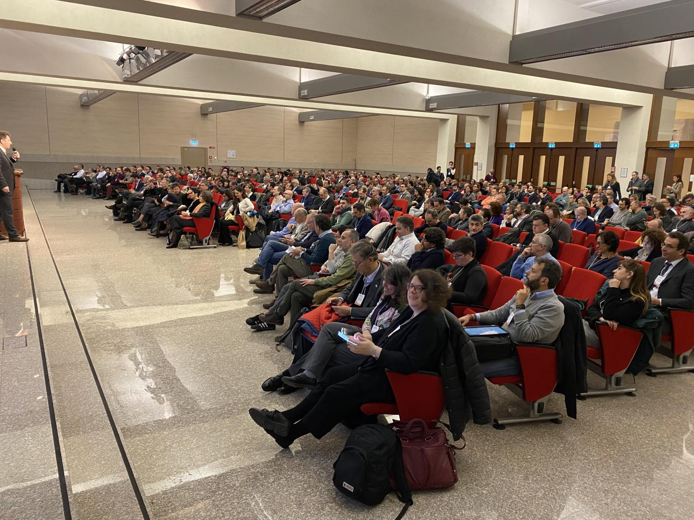

Me and Paolo Santinello, from [KlinK](http://www.klink.it/home.html), presented a talk at the annual meeting of the Project Management Institute - Northern Italy Chapter. Our talk _Il Dilemma dell'Algoritmo - questioni etiche e strumenti di IA nei processi decisionali di Project Management_ was given in front of more than 300 PMI Project Managers and partners.
We talked about how Agent Based Modeling can deal with uncertainty and ethics in the context of a specific project, raising the question of accountability of a decision in the presence of multiple options.

